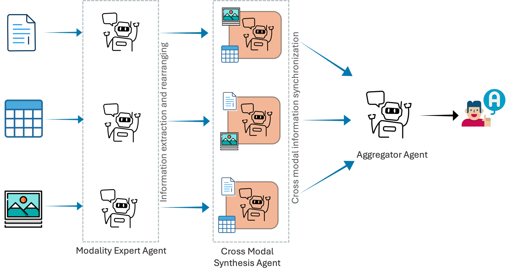

# Rethinking Information Synthesis in Multimodal Question Answering A Multi-Agent Perspective
[](https://aclanthology.org/2025.ijcnlp-long.192/)
[](https://arxiv.org/abs/2505.20816)
[](https://coral-lab-asu.github.io/MAMMQA/)
[](https://coral-lab-asu.github.io/presentation_docs/MAMMQA_Presentation.pdf)
[](./static/pdf/MAMMQA_Poster.pdf)
[](LICENSE)
[](https://www.python.org/downloads/)


This repository contains reference code for **MAMMQA**, a *multi-agent* framework for **multimodal question answering** over **text, tables, and images**.

---

## Overview



Multimodal Question Answering (MMQA) requires synthesizing information across **text, tables, and images**. Most existing approaches rely on a single large model to jointly reason over all modalities, often leading to shallow cross-modal grounding and limited interpretability.

**MAMMQA** rethinks multimodal reasoning from a *multi-agent perspective*.

Instead of a monolithic model, MAMMQA decomposes reasoning into specialized agents organized in three stages:

1. **Stage 1 – Modality Specialists**  
   Independent agents extract structured insights from each modality (text, tables, images).

2. **Stage 2 – Cross-Modal Refinement Agents**  
   Agents verify and refine each modality’s insights using evidence from other modalities, enabling deeper cross-modal grounding.

3. **Stage 3 – Aggregator Agent**  
   A final reasoning agent consolidates all intermediate outputs to produce a coherent and evidence-consistent answer.

This structured decomposition improves:
- 🔎 **Cross-modal alignment**
- 🧠 **Interpretability** via intermediate reasoning traces
- 🛡 **Robustness** by modular verification across modalities

Our experiments demonstrate that multi-agent synthesis provides stronger factual grounding and improved reasoning performance compared to standard single-agent baselines.

---


## Prerequisites

Create and activate a virtual environment, then install required packages:

```bash
python -m venv venv
source venv/bin/activate  # on windows: venv\Scripts\activate
pip install -U openai python-dotenv pandas pydantic spacy tabulate openai-agents
python -m spacy download en_core_web_sm
```

Create a `.env` file with your API keys:

```env
OPENAI_API_KEY=...
DASHSCOPE_API_KEY=...
GOOGLE_API_KEY=...
DEEPINFRA_TOKEN=...
```

---

## How to run — overview

Below are concrete, copy-pasteable examples to run the **baselines**, **Tree‑of‑Thoughts (ToT)** experiments, **our multi-agent pipeline (agents)**, and **evaluation (Eval.py)**. These examples assume you run them from the repository root and that `Dataloader.py`, `agents.py`, `treeofthoughts.py`, `tot_dfs.py`, and `Eval.py` are present.

If you prefer, create small wrapper scripts (examples provided below) to make repeated experiments easier.

---

## 1) Running baselines

Two baseline types are provided in `agents.py`:
- Zero-shot / direct answer baseline (`get_answer_zs_no_data(...)`).
- Chain-of-thought multimodal baseline (`get_answer_cot(...)`).

Run a baseline interactively (Python snippet). This directly calls the functions in `agents.py` and prints output:

```python
import os
from dotenv import load_dotenv
load_dotenv()

from openai import OpenAI
from Dataloader import MultiModalQADataLoader
import agents  # local agents.py

# init client (choose provider)
client = OpenAI(api_key=os.getenv("OPENAI_API_KEY"))

# load one example (adjust paths to your data)
dl = MultiModalQADataLoader(
    dev_file="data/dev.json",
    tables_file="data/tables.jsonl",
    texts_file="data/texts.jsonl",
    images_file="data/images.jsonl",
    images_base_url="data/images",
    encode_images=False
)
ex = dl.get_agent_inputs(0)

# run zero-shot baseline
zs = agents.get_answer_zs_no_data(client, ex["question"], model="gpt-4o-mini")
print("ZS baseline:", zs)

# run CoT baseline
cot = agents.get_answer_cot(client, ex["question"], ex["text"], ex["table"], ex["images"], model="gpt-4o-mini")
print("CoT baseline:", cot)

```

If you prefer a shell wrapper, create `run_baseline.py` with the above content (adapt dataset paths & model).

---

## 2) Running our multi‑agent pipeline (agents)

The main multi-agent pipeline is provided as functions in `agents.py` (e.g., `get_answer_MM`, `get_answer_Many`). Example to run the full 3-stage pipeline:

```python
import os
from dotenv import load_dotenv
load_dotenv()

from openai import OpenAI
from Dataloader import MultiModalQADataLoader
from agents import get_answer_MM  # or get_answer_Many

client = OpenAI(api_key=os.getenv("OPENAI_API_KEY"))

dl = MultiModalQADataLoader(
    dev_file="data/dev.json",
    tables_file="data/tables.jsonl",
    texts_file="data/texts.jsonl",
    images_file="data/images.jsonl",
    images_base_url="data/images",
    encode_images=False
)
ex = dl.get_agent_inputs(0)

res = get_answer_MM(
    client=client,
    question=ex["question"],
    text=ex["text"],
    tables=ex["table"],
    images=ex["images"],
    model="gpt-4o-mini",
    verbose=True  # prints intermediate agent outputs
)
print("Final Answer:\n", res["Final Answer"])

```

Key options:
- `model`: string model name used for LLM calls.
- `verbose`/`debug`: if supported, set to `True` to print intermediate agent decisions (specialists, cross-agents, aggregator).
- `encode_images`: if `True` the dataloader will embed images as base64 data URLs.

---

## 3) Running Tree‑of‑Thoughts (ToT) experiments

Two files are relevant:
- `treeofthoughts.py` — constructs "thought" candidates and scoring prompts
- `tot_dfs.py` — DFS driver implementing pruning and search over thoughts

Example invocation (interactive):

```python
import os
from dotenv import load_dotenv
load_dotenv()

from openai import OpenAI
from Dataloader import MultiModalQADataLoader
import treeofthoughts as tot
import tot_dfs as totdfs

client = OpenAI(api_key=os.getenv("OPENAI_API_KEY"))

dl = MultiModalQADataLoader(
    dev_file="data/dev.json", tables_file="data/tables.jsonl",
    texts_file="data/texts.jsonl", images_file="data/images.jsonl",
    images_base_url="data/images", encode_images=False
)
ex = dl.get_agent_inputs(0)

# Build initial thoughts (k candidates)
thoughts = tot.generate_initial_thoughts(client, ex["question"], ex["text"], k=5, model="gpt-4o-mini")
print("Candidates:", thoughts)

# Run DFS with pruning
result = totdfs.run_dfs(
    client=client,
    initial_thoughts=thoughts,
    question=ex["question"],
    text=ex["text"],
    k=3,
    beam_threshold=0.6,
    max_depth=4,
    model="gpt-4o-mini"
)
print("ToT best:", result)

```

Notes:
- `generate_initial_thoughts` and `run_dfs` are example function names — adjust based on the actual function names in your `treeofthoughts.py` and `tot_dfs.py`.
- Tune `k`, `beam_threshold`, and `max_depth` for runtime vs performance trade-offs.

---

## 4) Running evaluation (Eval.py)

`Eval.py` provides semantic match utilities and wrappers. A typical evaluation flow:

1. Run experiments and save predictions to JSONL or CSV with fields `id`, `question`, `predicted_answer`, `gold_answer`.
2. Run `Eval.py` to compute semantic accuracy / token-lemma matching.

Example (if `Eval.py` has a CLI that accepts paths):

```bash
python Eval.py --pred predictions.jsonl --gold data/dev.jsonl --out results.json --mode semantic
```

If `Eval.py` is a module with functions, call it interactively:

```python
from Eval import process_predictions, compute_semantic_accuracy
preds = "outputs/predictions.jsonl"
gold = "data/dev.jsonl"
report = compute_semantic_accuracy(preds, gold, normalize=True)
print(report)

```

**If `Eval.py` does not implement a CLI**, use the interactive snippet above and adapt to actual function names (e.g., `process_csv_file`, `compute_overall_accuracy`).

---

## Example wrapper scripts

Copy any of these into `run_agents.py`, `run_baseline.py`, `run_tot.py`, and run `python run_agents.py`.

`run_agents.py` (example stub):

```python
# run_agents.py
import os
from dotenv import load_dotenv
load_dotenv()
from openai import OpenAI
from Dataloader import MultiModalQADataLoader
from agents import get_answer_MM

client = OpenAI(api_key=os.getenv("OPENAI_API_KEY"))
dl = MultiModalQADataLoader("data/dev.json","data/tables.jsonl","data/texts.jsonl","data/images.jsonl","data/images",False)
ex = dl.get_agent_inputs(0)
res = get_answer_MM(client, ex["question"], ex["text"], ex["table"], ex["images"], model="gpt-4o-mini", verbose=True)
print(res["Final Answer"])
```

---

## Tips for reproducibility / experimentation

- Use deterministic seeds where possible for sampling parameters. If using temperature-based sampling, set `temperature=0` for deterministic outputs when comparing runs.
- Log intermediate agent outputs (specialists and cross-agents) to debug errors and hallucinations.
- For expensive runs, reduce ToT beam widths or DFS max depth first.

---

## Contact / Contributions

If you'd like, tell me which exact dataset files and model names you used in the paper (e.g., `gpt-4o-mini`, `gpt-4o`, `qwen-2.8b`), and I will add exact `Reproducing results` CLI commands for each experiment (baseline, ours, ToT, eval) and produce a downloadable script bundle.

---

## Citation

```bibtex
@inproceedings{anvekar-etal-2025-rethinking,
    title = "Rethinking Information Synthesis in Multimodal Question Answering A Multi-Agent Perspective",
    author = "Anvekar, Tejas  and
      Rajput, Krishna Singh  and
      Baral, Chitta  and
      Gupta, Vivek",
    editor = "Inui, Kentaro  and
      Sakti, Sakriani  and
      Wang, Haofen  and
      Wong, Derek F.  and
      Bhattacharyya, Pushpak  and
      Banerjee, Biplab  and
      Ekbal, Asif  and
      Chakraborty, Tanmoy  and
      Singh, Dhirendra Pratap",
    booktitle = "Proceedings of the 14th International Joint Conference on Natural Language Processing and the 4th Conference of the Asia-Pacific Chapter of the Association for Computational Linguistics",
    month = dec,
    year = "2025",
    address = "Mumbai, India",
    publisher = "The Asian Federation of Natural Language Processing and The Association for Computational Linguistics",
    url = "https://aclanthology.org/2025.ijcnlp-long.192/",
    pages = "3674--3686",
    ISBN = "979-8-89176-298-5"
}
```

---

## License

This project is licensed under the MIT License - see the [LICENSE](LICENSE) file for details.
